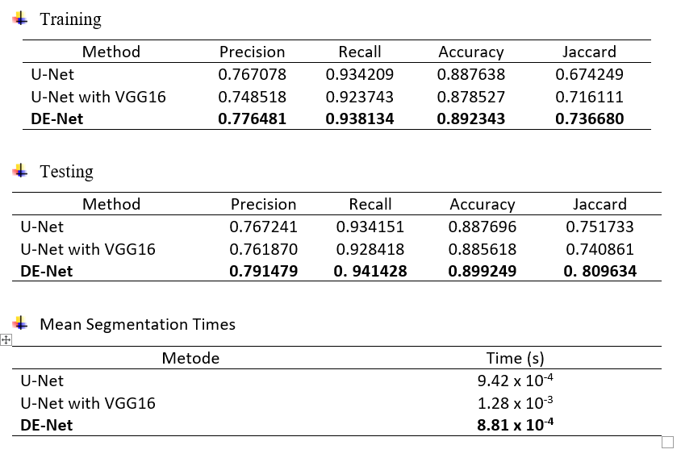

# Dilated-Encoder-Network-for-Image-Segmentation
Python implementations of Dilated Encoder Network (DE-Net)<br/>
[Deep learning techniques for automatic butterfly segmentation in ecological images](https://doi.org/10.1016/j.compag.2020.105739)

## Data
Download butterfly-dataset "[Josiah Wang, Katja Markert, and Mark Everingham
Learning Models for Object Recognition from Natural Language Descriptions
In Proceedings of the 20th British Machine Vision Conference (BMVC2009)](http://www.josiahwang.com/dataset/leedsbutterfly/)"

or

[Butterfly Dataset](https://www.kaggle.com/datasets/veeralakrishna/butterfly-dataset) using Kaggle API
```
!kaggle datasets download -d veeralakrishna/butterfly-dataset
```
then, unziping the zip files
```
#unzipping the zip files and deleting the zip files
!unzip \*.zip  && rm *.zip
```


## Results
<p align='center'>
  
</p>

<p align='center'>
  
  
</p>

<p align='center'>
  
  
</p>
