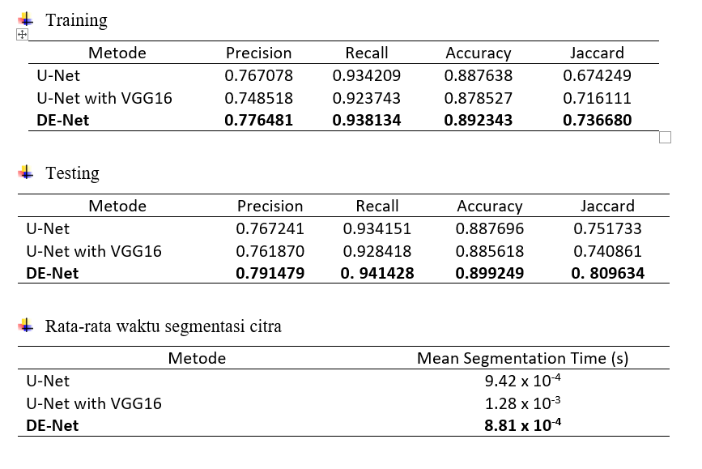
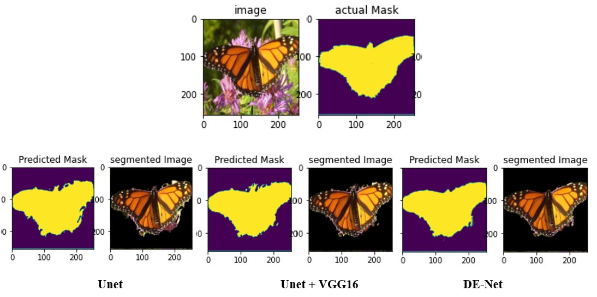
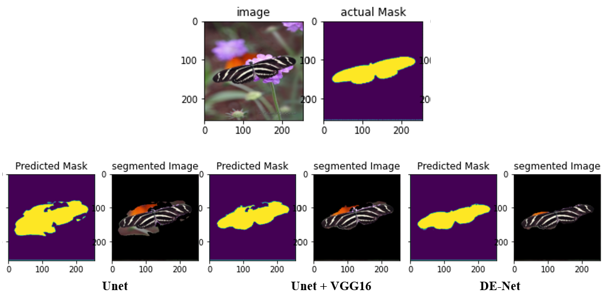
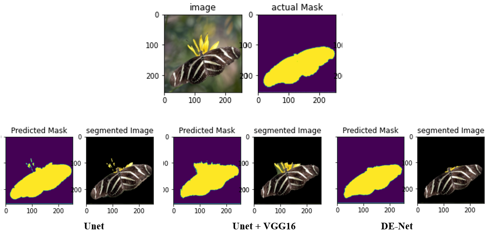
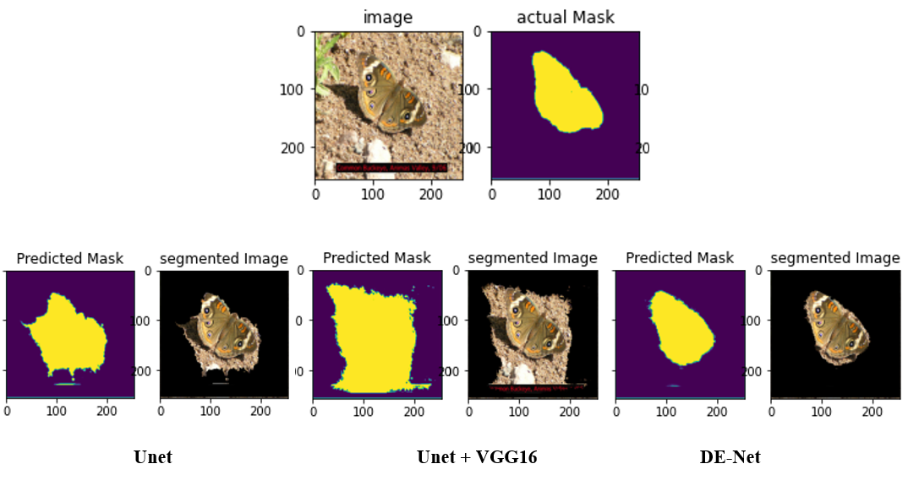

# Dilated-Encoder-Network-for-Image-Segmentation
Python implementations of Dilated Encoder Network (DE-Net) 
[Deep learning techniques for automatic butterfly segmentation in ecological images](https://doi.org/10.1016/j.compag.2020.105739)

### Results

  
<!--   
  
   -->

  
  

  
  

